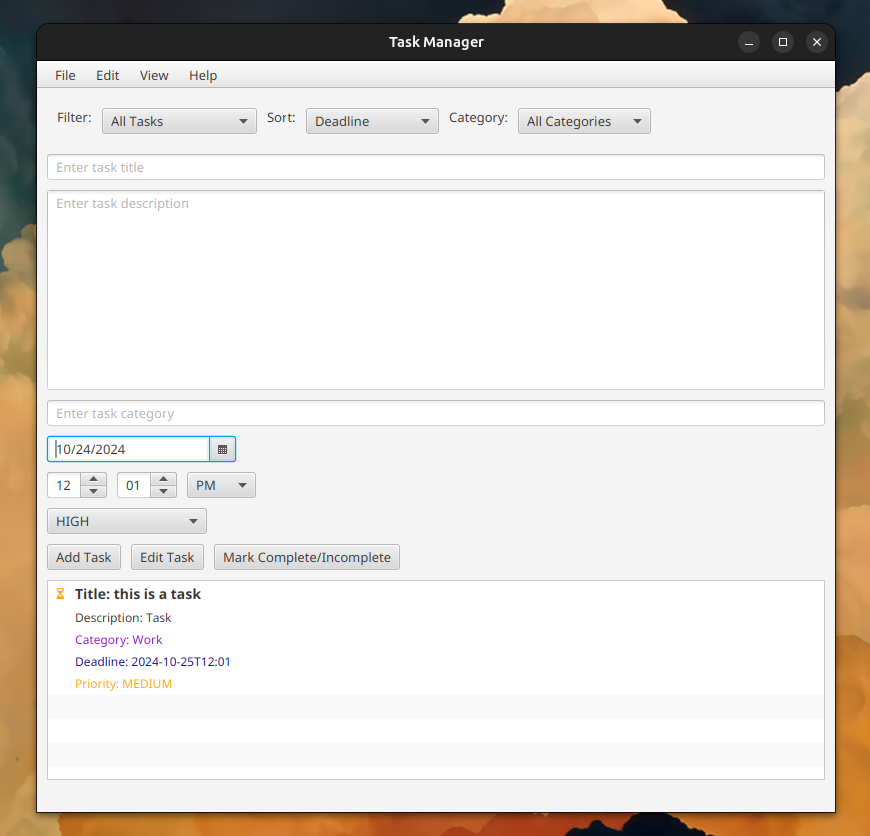

# Task Manager Lite

---------------------------------------------------------------------------
# A lightweight task manager app written in Java. 

# How to use
build using ./gradlew build

run using ./gradlew run
# Features as of 10/30/24
**Persistence** (Saving and Loading Tasks)

Add the ability to save tasks to a file (e.g., text ) and load them when the app starts. This will ensure that tasks persist across sessions.

**Edit Existing Tasks**

   Allow users to edit tasks (modify task title or description).

**Task Deadlines**

   Add a deadline (due date and time) to each task.

**Task Prioritization**

   Add a priority level (e.g., Low, Medium, High) for each task.

**Dark Mode**

   Switch to "dark mode" in the view tab. 
   
**Task Categories**

Allow users to assign categories to tasks.

**Task Reminders**

Add reminders that notify the user before a task is done. 

**User Authentication**

Users can create a pin to keep their tasks secure. Pin is stored locally.

**Calendar support**

.ics export functionality. 

**Email list - in progress**

Email tasks list